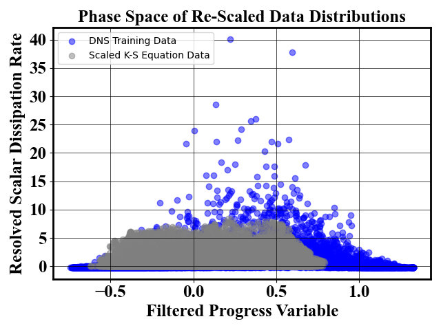

# Kuramoto–Sivashinsky Equation
As a demonstration of how to propagate the uncertainty in a Bayesian neural network model through a physics simulation, we chose the K-S equation as a test case.

The governing equation is
$$
u_t + u_{xx} + u_{xxxx} + \frac{1}{2}u_x^2 = f(u)
$$

Here we interpret $u$ as the filtered quantity and $D|\nabla u|^2$ as the resolved scalar dissipation rate. A Bayesian neural network model is trained using the DNS data for these two quantities and implemented as the source term, $f(u)$. We train a model on these two features from the full DNS dataset using the `train_kse_bnn.py` script.

As with throughout the repository, the scripts with the `viz_` prefix indicate post-processing scripts.

- `viz_data.py` is used to ensure that the phase space states that are seen during the solution of the KS equation roughly match the scale of the inputs to the BNN model as trained on the DNS data. We see that this is originally not the case, but that we may rescale the data so that it is correct.

  
  

- `viz_kse_prop.py` processes the uncertainty propagation data stored in `PREFIX/data/prop_log` and generates the mean prediciton plot as well as the pointwise variance plots for the ensemble of runs.

- `viz_kse_single.py` processes a single KS equation solve with a custom plot title. This was useful to generate the plot of the KS equation with a mean BNN forcing term, as it results in just one simulation.

- `viz_kse_pointwise.py` generates _a priori_ uncertainty estimates for the model conditioned upon the states seen without a source term. The pointwise variance is computed both with and without the rescaling effect.

  
  

The `util/` directory contains all of the utilities needed to solve the KS equation and run `main.py`.

The `jobs/` directory contains the job file used to set up and run the uncertainty propagation loop on Eagle.
