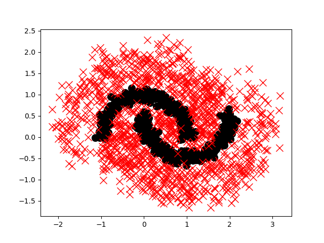
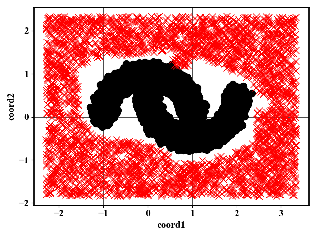

# Out-of-Distribution Data Generation
To generate out-of-distribution (OOD) data, we consider two methods: soft Brownian offset (SB0) and normalizing flows (NF).

## Data Generation with SBO
To generate data with the SBO method, in the `SBO` directory, call `bash exec.sh`

<p float="left">
  
</p>

### Reference
[Preprint version (open access)](https://arxiv.org/abs/2105.02965)


```
@inproceedings{moller2021out,
  title={Out-of-distribution detection and generation using soft brownian offset sampling and autoencoders},
  author={Moller, Felix and Botache, Diego and Huseljic, Denis and Heidecker, Florian and Bieshaar, Maarten and Sick, Bernhard},
  booktitle={Proceedings of the IEEE/CVF Conference on Computer Vision and Pattern Recognition},
  pages={46--55},
  year={2021}
}
```

## Data Generation with NF

In the `NF` directory, call `bash exec_moons.sh`.

<p float="left">
  
</p>

### Reference
[Preprint version (open access)](https://arxiv.org/abs/1906.04032)

```
@article{durkan2019neural,
  title={Neural spline flows},
  author={Durkan, Conor and Bekasov, Artur and Murray, Iain and Papamakarios, George},
  journal={Advances in neural information processing systems},
  volume={32},
  year={2019}
}
```
